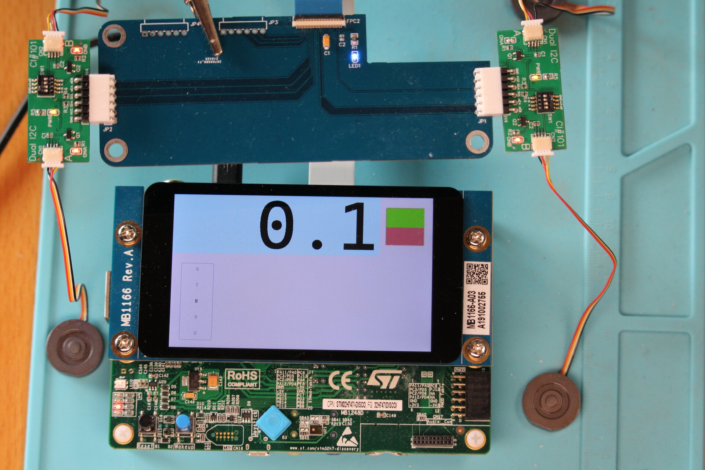

# H747-Test

This is a mix between using CubeMX to create the project with AzureRTOS enabled on both cores and
adding parts from the `LCD_DSI_CmdMode_DoubleBuffer` example for `STM32H747I_DISCO`

- M4 will :
  1. toggle the orange LED twice per second using 1 tx thread
  2. write things on the UART once per second using 1 tx thread
  3. read data from I2C1 and put the retrieved data in shared memory for M7 using 1 tx thread
  4. read data from I2C4, same as above; this includes data from touch-screen interface circuit

- M7 will :
  0. setup LCD display through some calls to BSP before launching the tx threads
  1. toggle blue LED once per second; retrieve touch screen data from the shared memory and post
     PEN events for guix using 1 tx thread; toggle green LED on PEN_DOWN and PEN_UP events
  2. start guix using 1 tx thread and setup a timer to periodically update a displayed value obtained
     from the shared memory (I2C data sent by M4)

GUIX was added as a git submodule

The display is generated from GUIX Studio and the large font is also generated by GS from the
Cascadia Code font available here : https://github.com/microsoft/cascadia-code/releases

## board view

https://user-images.githubusercontent.com/39457172/122681712-ff93c880-d1f5-11eb-9324-e82c05754de2.mp4

https://user-images.githubusercontent.com/39457172/114636730-0539d300-9cc8-11eb-848a-965ba606d748.mp4
